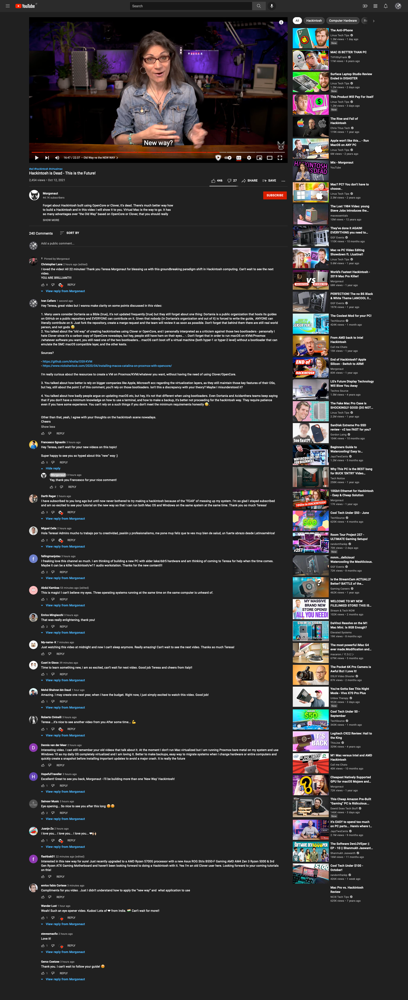
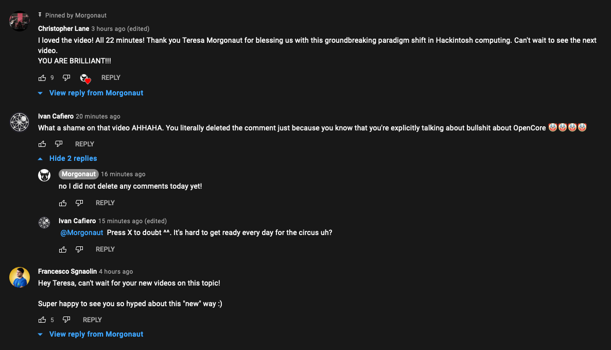

# Morgonaut-is-a-clown
Hey Teresa from Morgonaut, you're so qt3.14 deleting the truth. Let's see if you can delete this repo :D 

On Tue 12 Oct 20:08 GTM +2 (Rome), I posted the following comment on [this Morgonaut video](https://www.youtube.com/watch?app=desktop&v=lztH7BUxIoM&feature=youtu.be):

Long comment, expand the spoiler

Hey Teresa, great video but I wanna make clarity on some points discussed in this video:

1. Many users consider Dortania as a Bible (true), it's not updated frequently (true) but they still forget about one thing: Dortania is a public organization that hosts its guides on GitHub on a public repository and EVERYONE can contribute on it. Given that nobody (in Dortania's organization and out of it) is forced to write the guide,  ANYONE can literally contribute on it. Just fork the repository, create a merge request and the team will review it as soon as possible. Don't forget that behind them there are still real world person, and not gods 😅
2. You talked about the "old way" of creating hackintoshes using Clover or OpenCore, and I personally interpreted as a criticism against those two bootloaders - personally I hate Clover since it's a carbon copy of OpenCore nowadays, but hey, people still have ham on their eyes... -. Don't forget that in order to run macOS on KVM/Proxmox/whatever software you want, you still need one of the two bootloaders... macOS can't boot off a virtual machine (both hyper-1 or hyper-2 level) without a bootloader that can emulate the SMC macOS compatible layer, and the other kexts.

Sources? 

- https://github.com/kholia/OSX-KVM
- https://www.nicksherlock.com/2020/04/installing-macos-catalina-on-proxmox-with-opencore/

I'm really curious about the resources to create a VM on Proxmox/KVM/whatever you want, without having the need of using Clover/OpenCore.

3. You talked about how better is rely on bigger companies like Apple, Microsoft ecc regarding the virtualization layers, as they still maintain those key features of their OSs, but hey, still about the point 2 of this comment, you'll rely on those bootloaders. Isn't this a discrepancy with your theory? Maybe I misunderstood it?

4. You talked about how badly people argue on updating macOS etc, but hey, it's not that different when using bootloaders. Even Dortania and Acidanthera teams keep saying that if you don't have a minimum knowledge on how to use a terminal, and how to make a backup, it's better not proceeding for the hackintosh way. They require patience even if you have some experience. You can't rely on a such things if you don't meet the minimum requirements honestly 😅.

Other than that, yeah, I agree with your thoughts on the hackintosh scene nowadays.
Cheers

After a short reply of Morgonaut (screen incoming), and my next question, it got deleted. It's hard to get ready for the circus everyday uh?

# STOP GIVING FAME TO PEOPLE WHO DON'T DESERVE IT

Sincerely, a user who is really annoyed about the bullshit of this idiot
